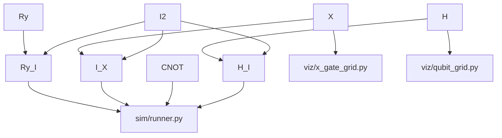

# gates.py — Quantum Gate Matrices

## What This Module Does

Every quantum computation starts with gates. A gate is just a matrix that
transforms a qubit's state vector. This module defines those matrices as
NumPy arrays so every other module can import exactly what it needs.

The design is intentional: **no classes, no functions for the single-qubit
gates** — just named constants. Gates are mathematical objects; they don't
need encapsulation.

## Single-Qubit Gates

The four standard single-qubit gates are 2×2 complex matrices:

```python
import numpy as np

X = np.array([[0, 1], [1, 0]], dtype=complex)       # NOT gate: flips |0⟩↔|1⟩
Y = np.array([[0, -1j], [1j, 0]], dtype=complex)    # rotation with phase
Z = np.array([[1, 0], [0, -1]], dtype=complex)      # phase flip on |1⟩
H = np.array([[1, 1], [1, -1]], dtype=complex) / np.sqrt(2)  # superposition

I2 = np.eye(2, dtype=complex)                       # identity — "do nothing"
```

`H` (Hadamard) is the workhorse of this codebase. It maps `|0⟩ → (|0⟩+|1⟩)/√2`,
putting a qubit into equal superposition. The `1/√2` normalization keeps
amplitudes valid (probabilities must sum to 1).

## Two-Qubit Tensor Products

Two qubits live in a 4-dimensional space. The tensor product `A⊗B` describes
applying gate `A` to qubit 0 and gate `B` to qubit 1 independently. NumPy's
`kron` computes the Kronecker product directly:

```python
# CNOT: controlled-NOT flips qubit 1 when qubit 0 is |1⟩
CNOT = np.array([
    [1, 0, 0, 0],
    [0, 1, 0, 0],
    [0, 0, 0, 1],
    [0, 0, 1, 0],
], dtype=complex)

H_I = np.kron(H, I2)   # Hadamard on qubit 0, identity on qubit 1
I_X = np.kron(I2, X)   # identity on qubit 0, NOT on qubit 1
```

The CNOT matrix is written explicitly rather than computed via `kron` because
it is a fundamental 2-qubit gate with no 1-qubit decomposition — making the
matrix visible in source code makes the structure transparent.

## Parameterised Rotation Gates

Grover's algorithm and asymmetric entanglement require rotations by arbitrary
angles. The Y-rotation gate smoothly interpolates between `I` (θ=0) and `X`
(θ=π):

```python
def Ry(theta: float) -> np.ndarray:
    c = np.cos(theta / 2)
    s = np.sin(theta / 2)
    return np.array([[c, -s], [s, c]], dtype=complex)

def Ry_I(theta: float) -> np.ndarray:
    return np.kron(Ry(theta), I2)
```

`Ry_I` applies the rotation to qubit 0 only. After `Ry_I(θ)|00⟩` followed by
CNOT, the state is `cos(θ/2)|00⟩ + sin(θ/2)|11⟩` — an entangled pair whose
correlations depend on θ.

## Data Flow



## Possible Improvements

- **Missing gates**: Toffoli (3-qubit CCNOT), S, T, and CZ gates are standard
  and would be needed for more complete circuit simulation.
- **Gate validation**: A helper `is_unitary(gate)` that asserts `U†U ≈ I`
  would catch accidental construction errors early.
- **Rx, Rz**: Only Ry is parameterised. Adding Rx and Rz would complete the
  SU(2) rotation family.
