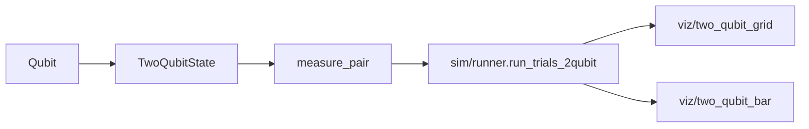

# two_qubit.py — Two Independent (Unentangled) Qubits

## Why This Module Exists

Before exploring entanglement, we need the baseline: two qubits that are
completely independent. This module models exactly that — two separate `Qubit`
objects measured together to produce a 2-bit outcome string.

The key distinction: an unentangled pair has no correlations. Knowing the
result of qubit 0 tells you nothing about qubit 1. Contrast this with
`two_qubit_entangled.py`, where a single 4-element state vector captures
correlations that cannot be factored into independent parts.

## The Dataclass

```python
from dataclasses import dataclass
from quant2.qubit import Qubit

@dataclass
class TwoQubitState:
    q0: Qubit
    q1: Qubit

    @classmethod
    def zero(cls) -> "TwoQubitState":
        return cls(q0=Qubit.zero(), q1=Qubit.zero())
```

`TwoQubitState` is a thin container. It bundles two independent `Qubit`
objects and provides a `zero()` factory that initialises both to `|0⟩`.
The dataclass is used mainly in tests and documentation — the runner
module creates qubits directly for performance.

## Joint Measurement

```python
def measure_pair(q0: Qubit, q1: Qubit) -> str:
    return f"{q0.measure()}{q1.measure()}"
```

Each qubit collapses independently. The result is a 2-character string like
`"01"` or `"10"`. Because the measurements are independent, applying `H` to
both before measuring produces all four outcomes `{"00","01","10","11"}` with
equal 25% probability — verifiable by inspection.

## Relationship to the System



`run_trials_2qubit` in `runner.py` doesn't use `TwoQubitState` directly; it
creates qubits inline for each trial. `measure_pair` is the shared boundary
that converts two `Qubit` instances into the outcome string format used
throughout the viz layer.

## Possible Improvements

- `TwoQubitState.apply(gate0, gate1)` would make the dataclass more
  self-contained, though `runner.py` currently handles gate application inline.
- The module could expose `product_state(gates0, gates1)` to encapsulate the
  prepare-and-measure pattern used in `run_trials_2qubit`.
