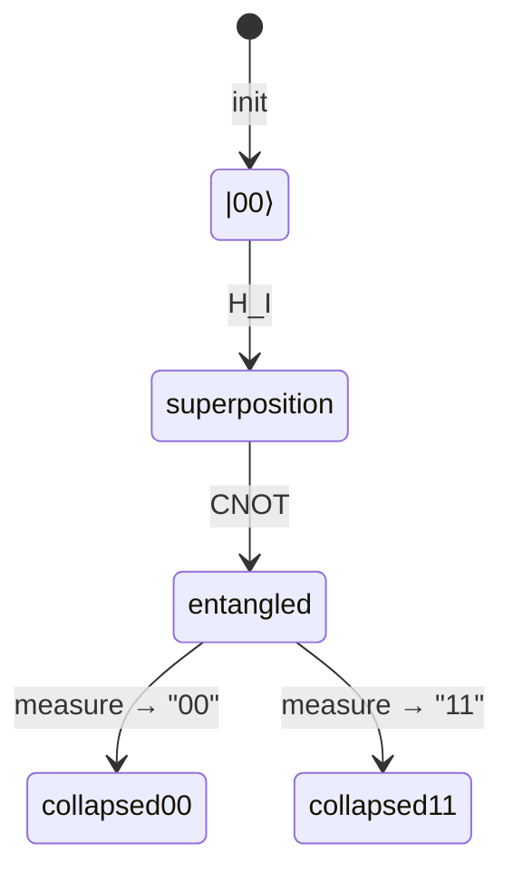

# two_qubit_entangled.py — Entangled Two-Qubit System

## The Core Idea

An entangled pair cannot be described as two independent qubits. Instead, the
system needs a single state vector over all four basis states:

```
|00⟩, |01⟩, |10⟩, |11⟩
```

`EntangledPair` holds a 4-element complex NumPy array representing amplitudes
for each basis state. Gates are 4×4 matrices applied to this vector. When
measured, the entire vector collapses to one basis state.

## Initialization

```python
class EntangledPair:
    def __init__(self):
        self.state = np.array([1.0, 0.0, 0.0, 0.0], dtype=complex)
```

Starting from `|00⟩` is the natural ground state. The four elements correspond
to amplitudes for `|00⟩`, `|01⟩`, `|10⟩`, `|11⟩` respectively.

## Applying Gates

```python
def apply(self, gate: np.ndarray) -> None:
    if gate.shape != (4, 4):
        raise ValueError(f"Gate must be 4x4, got {gate.shape}")
    self.state = gate @ self.state
```

Matrix-vector multiplication is the entire mechanism. Applying `H_I` (H on
qubit 0, identity on qubit 1) then `CNOT` creates the Bell state
`(|00⟩ + |11⟩)/√2` — the canonical entangled state.

Validation at the boundary: if a 2×2 single-qubit gate is accidentally passed,
it fails immediately with a clear message rather than silently producing wrong
results.

## Measurement and Collapse

```python
OUTCOMES = ["00", "01", "10", "11"]

def measure(self) -> str:
    probs = np.abs(self.state) ** 2
    probs = probs / probs.sum()
    idx = int(np.random.choice(4, p=probs))
    collapsed = np.zeros(4, dtype=complex)
    collapsed[idx] = 1.0
    self.state = collapsed
    return OUTCOMES[idx]
```

Born rule: probability of each outcome equals the squared magnitude of its
amplitude. After measurement, the state collapses — the `EntangledPair` is now
in a definite basis state. The explicit renormalisation (`probs / probs.sum()`)
guards against floating-point drift over many gate applications.

## Bell States via Gate Sequences

The 4×4 gate framework enables standard entangled states:

| Gate sequence | Resulting state | Outcomes |
|---|---|---|
| `[H_I, CNOT]` | `\|Φ+⟩ = (\|00⟩+\|11⟩)/√2` | 00 or 11, 50/50 |
| `[H_I, CNOT, I_X]` | `\|Ψ+⟩ = (\|01⟩+\|10⟩)/√2` | 01 or 10, anti-correlated |
| `[Ry_I(θ), CNOT]` | `cos(θ/2)\|00⟩ + sin(θ/2)\|11⟩` | 00 or 11, biased |

These are the three sequences exercised in `runner.py`.

## State Space Diagram



## Possible Improvements

- **Partial measurement**: measuring only qubit 0 would collapse to a 2-element
  reduced state, enabling multi-step protocols. Currently only full measurement
  is supported.
- **State validation**: an `is_normalized()` check would help catch drift in
  long simulations.
- **Multi-qubit extension**: the pattern generalises to N qubits (2^N state
  vector), but the class is hardcoded to 4 states.
