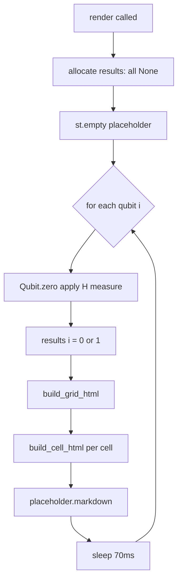

# qubit_grid — Animated Qubit Measurement Grid

## What It Does

`qubit_grid.py` renders a live, animated grid showing repeated single-qubit measurements. Each cell represents one experiment: apply the Hadamard gate to |0⟩, then measure. The grid fills left-to-right, one cell at a time, pausing briefly between measurements so the viewer can watch the random outcomes accumulate.

The visualization is the central pedagogical artifact for Chapter 1: it makes the probabilistic nature of quantum measurement viscerally visible.

## Architecture: Separated Asset Files

The module deliberately separates concerns across four files:

```
qubit_grid.py           — Python logic: data, animation loop
qubit_grid.css          — All visual styling
qubit_grid.html         — Grid/cell HTML structure template
content/images/qbit.svg — Qubit icon (orbital/atom glyph)
```

Python loads assets at import time using `Path(__file__).parent`:

```python
_HERE = Path(__file__).parent
_CSS = (_HERE / "qubit_grid.css").read_text()
_TEMPLATE = (_HERE / "qubit_grid.html").read_text()
_SVG_ICON = (_HERE / "../../content/images/qbit.svg").resolve().read_text()
```

The SVG icon path resolves to `content/images/qbit.svg` relative to the repo root. This keeps the icon alongside other content assets rather than buried inside `src/viz/`. The `resolve()` call normalises the `../../` traversal to an absolute path at import time, catching missing-file errors immediately rather than at render time.

This keeps CSS, HTML structure, and icons out of Python strings entirely — they live in their natural formats, editable with normal tooling.

## Color and Label Encoding

Three states map to distinct colors:

```python
COLORS = {
    "unmeasured": "#aaaaaa",   # grey  — not yet run
    0: "#2266cc",              # blue  — measured |0⟩
    1: "#cc2222",              # red   — measured |1⟩
}
LABELS = {None: "?", 0: "0", 1: "1"}
```

The SVG icon uses `fill="currentColor"`, so the CSS `color` property on its parent element tints the glyph automatically — no separate icon variants needed.

## Cell Construction

Each cell is built by `build_cell_html()`:

```python
def build_cell_html(idx: int, outcome: int | None) -> str:
    color = COLORS[outcome] if outcome is not None else COLORS["unmeasured"]
    label = LABELS[outcome]
    svg = _SVG_ICON.replace('width="1em" height="1em"', 'width="2em" height="2em"')
    return (
        f'<div class="qg-cell">'
        f'<div class="qg-label">experiment #{idx + 1}</div>'
        f'<span class="qg-icon" style="color:{color};">{svg}</span>'
        f'<div class="qg-outcome" style="color:{color};">{label}</div>'
        f'</div>'
    )
```

The SVG size override (`1em` → `2em`) is applied inline because the icon file stores its canonical display size and the grid needs it larger. A future improvement would parameterize this in the CSS instead.

## Grid Assembly and Animation

`build_grid_html()` assembles cells into the CSS grid template:

```python
def build_grid_html(results: list[int | None], n: int) -> str:
    cells = "".join(build_cell_html(i, results[i]) for i in range(n))
    return _TEMPLATE.format(css=_CSS, cols=COLS, cells=cells)
```

`render()` drives the animation via a single Streamlit placeholder that is rewritten each frame:

```python
def render(args: list[str], placeholder=None) -> None:
    n = int(args[0]) if args else 16
    results: list[int | None] = [None] * n
    if placeholder is None:
        placeholder = st.empty()
    for i in range(n):
        results[i] = Qubit.zero().apply(H).measure()
        placeholder.markdown(build_grid_html(results, n), unsafe_allow_html=True)
        time.sleep(0.07)
```

`st.empty()` is key: replacing its content rerenders only that region, not the whole page. The 70ms sleep is fast enough to feel animated but slow enough for the eye to follow individual outcomes.

## Data Flow



## Possible Improvements

- **SVG size via CSS**: The `width="2em"` override is a string replacement hack. A cleaner approach is a CSS class that overrides the SVG's intrinsic size.
- **Configurable columns**: `COLS = 8` is hardcoded. An `args` parameter would let chapter authors control layout.
- **Speed control**: The 70ms sleep is hardcoded. Exposing it via `args` would allow slower demos or instant batch display.
- **Shared color palette**: Colors are defined in Python and duplicated risk in CSS. CSS variables in `qubit_grid.css` could be the single source of truth.
