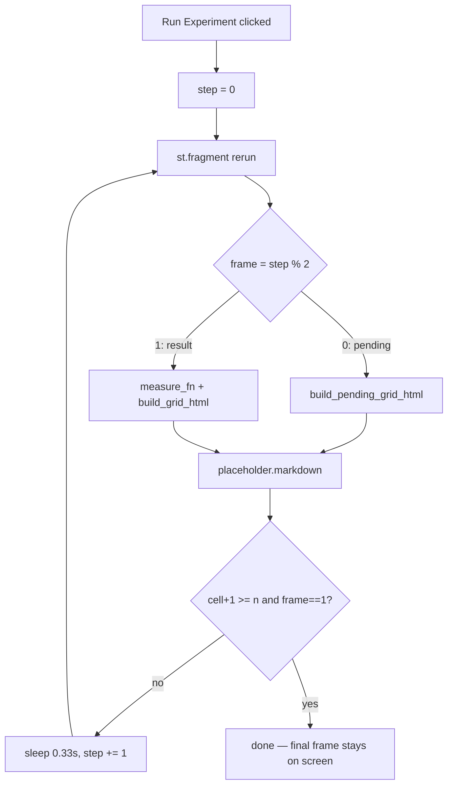

# qubit_grid — Animated Qubit Measurement Grid

## What It Does

`qubit_grid.py` renders a live, animated grid showing repeated single-qubit measurements. Each cell represents one experiment: apply the Hadamard gate to |0⟩, then measure. The grid fills left-to-right, one cell at a time, pausing briefly between measurements so the viewer can watch the random outcomes accumulate.

The visualization is the central pedagogical artifact for Chapter 1: it makes the probabilistic nature of quantum measurement viscerally visible.

## Architecture: Separated Asset Files

The module deliberately separates concerns across four files:

```
qubit_grid.py           — Python logic: data, animation loop
qubit_grid.css          — All visual styling
qubit_grid.html         — Grid/cell HTML structure template
content/images/qbit.svg — Qubit icon (orbital/atom glyph)
```

Python loads assets at import time using `Path(__file__).parent`:

```python
HERE = Path(__file__).parent
CSS = (HERE / "qubit_grid.css").read_text()
TEMPLATE = (HERE / "qubit_grid.html").read_text()
SVG_ICON = (HERE / "../../content/images/qubit.svg").resolve().read_text()
```

The SVG icon path resolves to `content/images/qbit.svg` relative to the repo root. This keeps the icon alongside other content assets rather than buried inside `src/viz/`. The `resolve()` call normalises the `../../` traversal to an absolute path at import time, catching missing-file errors immediately rather than at render time.

This keeps CSS, HTML structure, and icons out of Python strings entirely — they live in their natural formats, editable with normal tooling.

## Color and Label Encoding

Three states map to distinct colors:

```python
COLORS = {
    "unmeasured": "#aaaaaa",   # grey  — not yet run
    0: "#2266cc",              # blue  — measured |0⟩
    1: "#cc2222",              # red   — measured |1⟩
}
LABELS = {None: "?", 0: "0", 1: "1"}
```

The SVG icon uses `fill="currentColor"`, so the CSS `color` property on its parent element tints the glyph automatically — no separate icon variants needed.

## Cell Construction

Each cell is built by `build_cell_html()`:

```python
def build_cell_html(idx: int, outcome: int | None) -> str:
    color = COLORS[outcome] if outcome is not None else COLORS["unmeasured"]
    label = LABELS[outcome]
    svg = SVG_ICON.replace('width="1em" height="1em"', 'width="2em" height="2em"')
    return (
        f'<div class="qg-cell">'
        f'<div class="qg-label">experiment #{idx + 1}</div>'
        f'<span class="qg-icon" style="color:{color};">{svg}</span>'
        f'<div class="qg-outcome" style="color:{color};">{label}</div>'
        f'</div>'
    )
```

The SVG size override (`1em` → `2em`) is applied inline because the icon file stores its canonical display size and the grid needs it larger. A future improvement would parameterize this in the CSS instead.

## Grid Assembly

`build_grid_html()` assembles final (measured) cells; `build_pending_grid_html()`
does the same but renders any still-`None` cell as a pulsing yellow `?`
(via `build_pending_cell_html`, colored with `PENDING_COLOR = "#ccaa00"`):

```python
def build_grid_html(results: list[int | None], n: int) -> str:
    cells = "".join(build_cell_html(i, results[i]) for i in range(n))
    return TEMPLATE.format(css=CSS, cols=COLS, cells=cells)


def build_pending_grid_html(results: list[int | None], n: int) -> str:
    cells = "".join(
        build_pending_cell_html(i)
        if results[i] is None
        else build_cell_html(i, results[i])
        for i in range(n)
    )
    return TEMPLATE.format(css=CSS, cols=COLS, cells=cells)
```

## Two Animation Paths: Blocking vs. Step-Driven

`render()` is the simple, blocking version — used as a fallback and directly
in tests. It owns its own loop and its own `time.sleep`:

```python
def render(args: list[str], placeholder=None) -> None:
    n = int(args[0]) if args else 16
    results: list[int | None] = [None] * n
    if placeholder is None:
        placeholder = st.empty()
    for i in range(n):
        html = build_pending_grid_html(results[:i + 1], i + 1)
        placeholder.markdown(html, unsafe_allow_html=True)
        time.sleep(0.33)
        results[i] = Qubit.zero().apply(H).measure()
        html = build_grid_html(results[:i + 1], i + 1)
        placeholder.markdown(html, unsafe_allow_html=True)
        time.sleep(0.33)
```

But the live app never actually calls `render()` for the animated path —
`chapter_renderer.make_viz_fragment` drives a *step-based* variant instead,
one Streamlit fragment rerun per frame, so the "▶ Run Experiment" button
stays responsive instead of blocking the whole page for the animation's
duration. `animate_single_qubit_grid` is the step function, shared by both
`qubit_grid.py` and `zero_qubit_grid.py`:

```python
def animate_single_qubit_grid(
    measure_fn: Callable, args: list[str], step: int, key: str, placeholder
) -> bool:
    n = int(args[0]) if args else 16
    results_key = f"{key}_results"

    if step == 0:
        st.session_state[results_key] = [None] * n
    results = st.session_state.get(results_key, [None] * n)

    cell = step // 2
    frame = step % 2
    if frame == 0:
        html = build_pending_grid_html(results[:cell + 1], cell + 1)
        placeholder.markdown(html, unsafe_allow_html=True)
        return False

    results[cell] = measure_fn()
    st.session_state[results_key] = results
    html = build_grid_html(results[:cell + 1], cell + 1)
    placeholder.markdown(html, unsafe_allow_html=True)

    if cell + 1 >= n:
        st.session_state.pop(results_key, None)
        return True
    return False
```

Two frames per cell (`?` pending, then the measured result), state carried
across fragment reruns in `st.session_state` since the function itself is
stateless between calls — `key` scopes that state per visualization
instance, so multiple grids on the same page don't collide.

### A Bug in the Completion Frame

An earlier version checked `cell >= n` in a guard clause *before* drawing
anything, and returned `True` there — meaning "done" was only reported on
an extra, trailing call that came *after* the one that drew the final
cell's result. Streamlit fragments replace their entire rendered output on
every rerun, so that trailing call — which drew nothing into a freshly
created placeholder — blanked out the last frame the user had just watched
finish. The fix folds the completion check into the same branch that draws
the final frame, so "done" is only ever reported on a call that also drew
something:

```python
    if cell + 1 >= n:
        st.session_state.pop(results_key, None)
        return True
    return False
```

The general lesson: in a step machine driven by "call again until done",
the call that reports completion must be the *same* call that produces the
final visible state — never a follow-up call whose only job is to say "stop
calling me," because whatever renders (or fails to render) on that call is
what the user is left looking at.

## Data Flow


```mermaid
graph TD
    A[Run Experiment clicked] --> B[step = 0]
    B --> C[st.fragment rerun]
    C --> D{frame = step % 2}
    D -->|0: pending| E[build_pending_grid_html]
    D -->|1: result| F[measure_fn + build_grid_html]
    E --> G[placeholder.markdown]
    F --> G
    G --> H{cell+1 >= n and frame==1?}
    H -->|no| I[sleep 0.33s, step += 1]
    I --> C
    H -->|yes| J[done — final frame stays on screen]
```

## Possible Improvements

- **SVG size via CSS**: The `width="2em"` override is a string replacement hack. A cleaner approach is a CSS class that overrides the SVG's intrinsic size.
- **Configurable columns**: `COLS = 8` is hardcoded. An `args` parameter would let chapter authors control layout.
- **Speed control**: The 0.33s per-frame sleep is hardcoded (in `render()` and, effectively, in `chapter_renderer`'s fragment loop). Exposing it via `args` would allow slower demos or instant batch display.
- **Completion-state test coverage**: the fix to `animate_single_qubit_grid`'s final-frame bug is now covered by a regression test, but the pattern is duplicated across three files (`qubit_grid.py`, `two_qubit_grid.py`, `x_gate_grid.py`). A shared step-machine helper (draw-then-check-done) could eliminate the duplication and the class of bug at once.
- **Shared color palette**: Colors are defined in Python and duplicated risk in CSS. CSS variables in `qubit_grid.css` could be the single source of truth.
