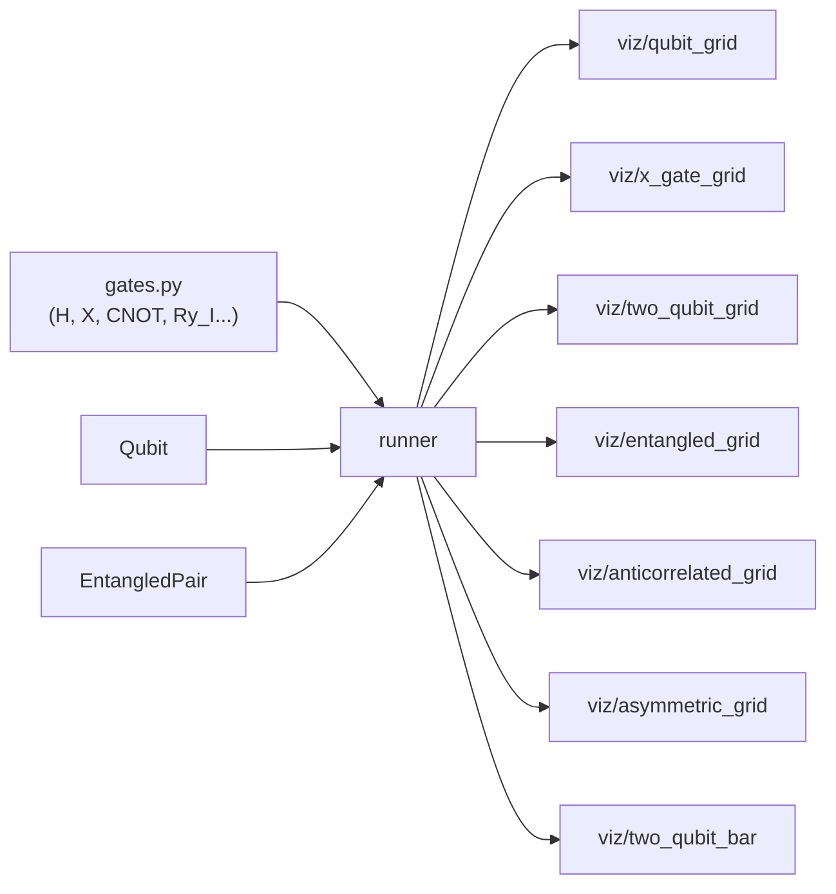

# runner.py — Multi-Trial Simulation Runner

## Purpose

The runner module is the simulation layer between quantum state objects and
visualisations. It runs N independent trials of a gate sequence and returns
outcome frequency dictionaries. Visualisations consume these dictionaries;
they never touch `Qubit` or `EntangledPair` directly.

## Design: Stateless Functions

Every function creates fresh state per trial:

```python
def run_trials(gate_sequence: list, n: int) -> dict[int, int]:
    if n <= 0:
        raise ValueError(f"n must be > 0, got {n}")
    counts = {0: 0, 1: 0}
    for _ in range(n):
        q = Qubit.zero()
        for gate in gate_sequence:
            q = q.apply(gate)
        counts[q.measure()] += 1
    return counts
```

No shared state means any number of trials can run in any order without
side effects. Each trial starts from `|0⟩` and goes through the gate
sequence independently — exactly what quantum mechanics requires.

## Two-Qubit Unentangled Trials

```python
def run_trials_2qubit(gates0: list, gates1: list, n: int) -> dict[str, int]:
    counts: dict[str, int] = {"00": 0, "01": 0, "10": 0, "11": 0}
    for _ in range(n):
        q0 = Qubit.zero()
        for gate in gates0:
            q0 = q0.apply(gate)
        q1 = Qubit.zero()
        for gate in gates1:
            q1 = q1.apply(gate)
        counts[measure_pair(q0, q1)] += 1
    return counts
```

Two separate gate sequences allow different gates on each qubit. The result
keys are always all four 2-bit strings — this ensures callers never encounter
a `KeyError` even if some outcomes have count zero.

## Entangled Trials

```python
def run_trials_entangled(gate_sequence: list, n: int) -> dict[str, int]:
    counts: dict[str, int] = {"00": 0, "01": 0, "10": 0, "11": 0}
    for _ in range(n):
        pair = EntangledPair()
        for gate in gate_sequence:
            pair.apply(gate)
        counts[pair.measure()] += 1
    return counts
```

A single gate sequence applies 4×4 matrices to a 4-element state vector.
Entanglement arises from the gate sequence itself (e.g. `H_I` followed by
`CNOT`) — the runner doesn't know or care about the physics.

## Convenience Wrappers

Two named wrappers encapsulate specific physical scenarios:

```python
def run_trials_anticorrelated(n: int) -> dict[str, int]:
    """Anti-correlated Bell state |Ψ+⟩ = (|01⟩+|10⟩)/√2."""
    return run_trials_entangled([H_I, CNOT, I_X], n)

def run_trials_asymmetric(theta: float, n: int) -> dict[str, int]:
    """Asymmetric entangled state cos(θ/2)|00⟩ + sin(θ/2)|11⟩."""
    return run_trials_entangled([Ry_I(theta), CNOT], n)
```

These exist so visualisation modules don't need to import gate constants.
They encode specific physics: `I_X` flips qubit 1 after the Bell state to
flip correlations; `Ry_I(theta)` biases the entangled amplitudes.

## Data Flow



## Possible Improvements

- **Batched single-trial calls**: visualisations currently call `run_trials(…, 1)`
  in a loop to animate one-by-one. A generator variant `trial_stream(gates, n)`
  yielding outcomes one at a time would make the pattern explicit and avoid the
  wasteful per-call dict creation.
- **Seed parameter**: adding `seed: int | None = None` to each function would
  make results reproducible for testing without global state.
