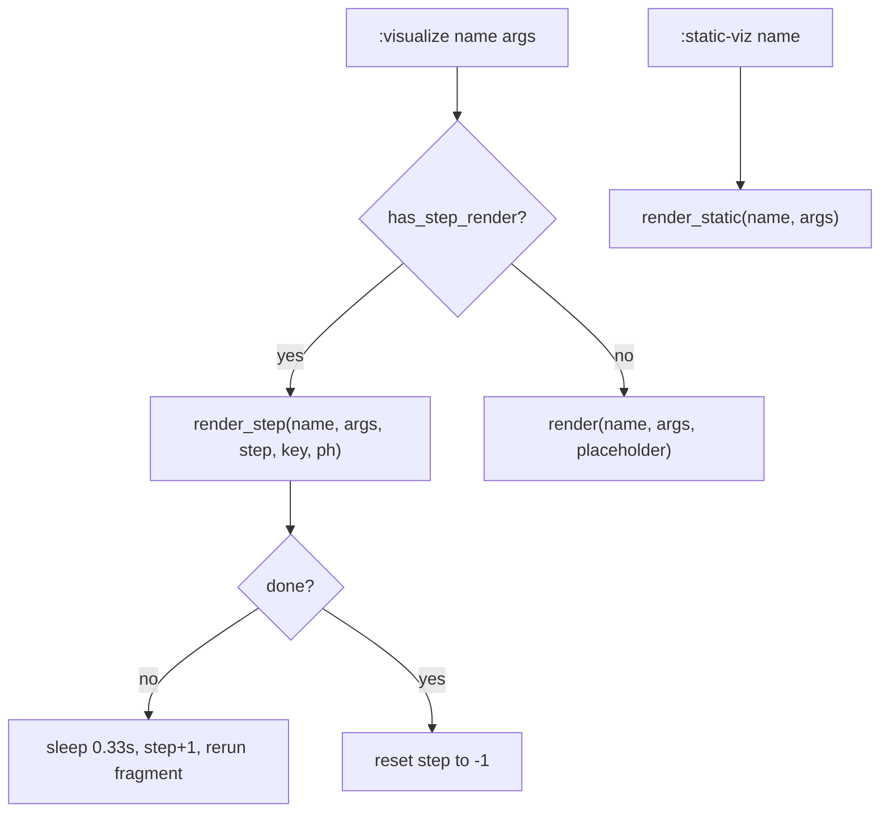

# registry.py — Named Visualization Registry

## What It Does

The registry is the glue between markdown chapter files and Python
visualization functions. A chapter file declares a viz by name
(`:visualize qubit-grid 20`), and the registry resolves that name to
a callable at render time.

## Three Registries

As of F15/F16, three distinct dispatch tables exist:

```python
REGISTRY: dict[str, callable] = {}       # legacy blocking render
STEP_REGISTRY: dict[str, callable] = {}  # step-based animated render
STATIC_REGISTRY: dict[str, callable] = {} # always-visible, no button
```

**REGISTRY** holds the original `render(args, placeholder)` signature —
used as a fallback when a viz has no step renderer.

**STEP_REGISTRY** holds `render_step(args, step, key, placeholder) -> bool` —
the step-based non-blocking animation protocol. Returning `True` signals
the animation is complete.

**STATIC_REGISTRY** holds vizes that render immediately on page load with no
"Run Experiment" button. Used for the legend and other always-visible content.

## Dispatch Flow



## Registration

Each viz module calls `registry.register*` at module level so importing
the module is sufficient to make it available:

```python
registry.register("qubit-grid", render)
registry.register_step("qubit-grid", render_step_qubit_grid)
registry.register_static("zero-qubit-legend", render_legend)
```

`book.py` imports all viz modules (with `# noqa: F401`) so every viz
is registered before any chapter text is rendered.

## Observations

- The three-registry pattern works but couples the chapter renderer to
  knowing about all three. A single `Viz` dataclass with optional fields
  would be cleaner and easier to extend.
- `has_step_render` is a boolean predicate — the caller branches on it.
  Consider a unified `render_viz(name, ...)` that dispatches internally.
