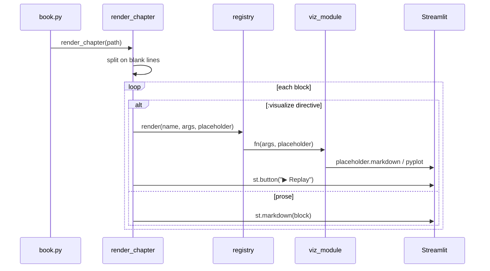

# chapter_renderer.py — Markdown Chapter Renderer with Visualization Directives

## The Problem It Solves

A chapter file mixes explanatory prose and live simulations. Pure `st.markdown`
handles the prose. Simulations need Python code, timing loops, and Streamlit
placeholders. The renderer parses a markdown file, identifies `:visualize`
directives, and dispatches them to registered Python render functions.

## Parsing Strategy

The renderer splits on blank lines (double newline), treating each paragraph as
either prose or a directive:

```python
def render_chapter(path: Path, viz_counter: list[int] | None = None) -> None:
    if viz_counter is None:
        viz_counter = [0]
    text = path.read_text()
    blocks = [b.strip() for b in text.strip().split("\n\n") if b.strip()]
    for block in blocks:
        first_line = block.splitlines()[0]
        if first_line.startswith(":visualize"):
            words = first_line.split()
            name = words[1]
            args = words[2:]
            key = f"replay_{name}_{viz_counter[0]}"
            viz_counter[0] += 1
            make_viz_fragment(name, args, key)()
        else:
            st.markdown(block)
```

Any block whose first line starts with `:visualize` is a directive; everything
else is passed directly to `st.markdown`. The format is:

```
:visualize <name> [arg1 arg2 ...]
```

For example, `:visualize grover-anim 11` calls the grover animation with
target state `"11"`.

## Per-Visualization Replay with st.fragment

Each visualization is wrapped in an `@st.fragment` function. Fragments in
Streamlit re-execute independently when triggered — clicking "Replay" reruns
only that fragment, not the whole page:

```python
def make_viz_fragment(name: str, args: list[str], key: str):
    @st.fragment
    def viz_fragment():
        registry.render(name, args)
        st.button("▶ Replay", key=key)
    return viz_fragment
```

The `key` parameter must be unique across all visualizations on the page.
The `viz_counter` list (mutable int in a list, passed by reference) ensures
each directive gets a distinct key even when the same visualization appears
multiple times.

A list is used instead of an integer because Python closures capture variables
by reference — a plain `int` counter would not be shared correctly across calls.

## Rendering the Full Book

```python
def render_book(paths: list[Path]) -> None:
    viz_counter = [0]
    for path in paths:
        render_chapter(path, viz_counter)
```

`render_book` shares the counter across multiple files, ensuring globally
unique replay keys. Currently the codebase uses a single `book.md` file and
calls `render_chapter` directly, but `render_book` remains available for
multi-file layouts.

## Execution Flow



## Possible Improvements

- **Multi-line directives**: currently only the first line of a block is parsed.
  A `:visualize` block could support YAML args on subsequent lines for complex
  configuration.
- **Error display in page**: unknown visualization names raise exceptions that
  crash the app. Rendering an error box in place of the missing viz would be
  more resilient during chapter authoring.
- **Heading detection**: the current split-on-blank-lines approach groups a
  heading and its following paragraph into separate blocks correctly, but a
  heading immediately before a `:visualize` directive would render the heading
  and viz correctly only because the split is clean. This assumption could
  break with more complex markdown structure.
