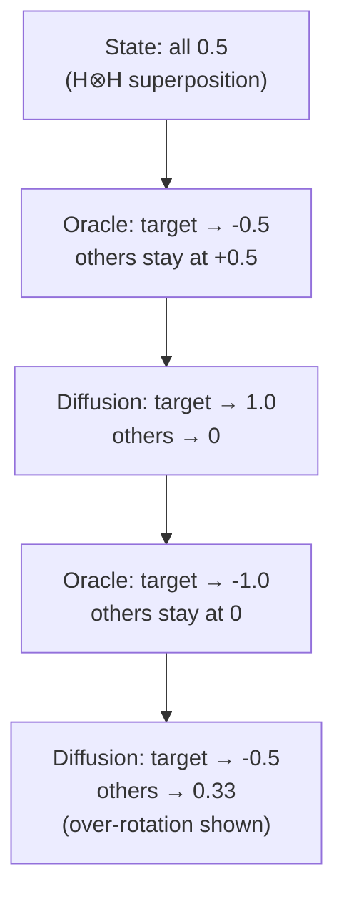

# grover_anim.py — Grover's Algorithm Amplitude Animation

## What Grover's Algorithm Does

Grover's algorithm searches an unsorted database of N items in O(√N) steps
instead of O(N). For 2 qubits (N=4 states), it finds a marked state in a
single iteration with probability 1.

The key insight: rather than checking each state, Grover amplifies the
amplitude of the target state and suppresses all others. The two operations
that achieve this are the **oracle** (marks the target by flipping its sign)
and the **diffusion operator** (inverts all amplitudes around their average).

## Constants and Setup

```python
STATES = ["|00⟩", "|01⟩", "|10⟩", "|11⟩"]
STATE_INDEX = {"00": 0, "01": 1, "10": 2, "11": 3}

GROVER_N = 4
DIFFUSION = (2 / GROVER_N) * np.ones((GROVER_N, GROVER_N)) - np.eye(GROVER_N)
```

The diffusion matrix implements inversion about the mean. For N=4, each
off-diagonal entry is 2/4 = 0.5; diagonal entries are 0.5 - 1 = -0.5.
Applying this to a state vector subtracts each amplitude from the mean and
inverts the difference — amplitudes above the mean are pushed down,
amplitudes below (like the negated target after the oracle) are boosted.

## Oracle Construction

```python
def make_oracle(target_idx: int) -> np.ndarray:
    op = np.eye(GROVER_N)
    op[target_idx, target_idx] = -1
    return op
```

A phase-flip oracle is a diagonal matrix that is identity everywhere except
at the target index, where it is -1. Applying this to a state vector flips
the sign of the target amplitude while leaving all others unchanged.

## Frame Computation

```python
def build_grover_frames(target: str) -> list[tuple[np.ndarray, str]]:
    target_idx = STATE_INDEX[target]
    oracle = make_oracle(target_idx)
    state = np.full(GROVER_N, 0.5)    # H⊗H: equal superposition
    frames = []
    frames.append((state.copy(), "Step 1: Equal superposition"))

    for iteration in range(1, 3):
        state = oracle @ state
        frames.append((state.copy(), f"Step ...: Oracle marks |{target}⟩"))
        state = DIFFUSION @ state
        frames.append((state.copy(), f"Step ...: Diffusion amplifies target"))

    return frames
```

Five frames total: initial superposition, then two cycles of (oracle,
diffusion). After the first diffusion, the target amplitude reaches 1.0 for
N=4 — this is the pedagogical "magic moment." The second iteration
over-rotates, deliberately demonstrating that more Grover steps can hurt.

## Amplitude Visualization

```python
def draw_amplitude_frame(amplitudes: np.ndarray, label: str, target: str) -> Figure:
    target_idx = STATE_INDEX[target]
    colors = [
        "#ff9900" if i == target_idx else "#2266cc"
        for i in range(GROVER_N)
    ]  # simplified — actual code also varies color by sign
    fig, ax = plt.subplots(figsize=(6, 4))
    ax.bar(STATES, amplitudes, color=colors, ...)
    ax.axhline(0, ...)
    ax.axhline(0.5, color="gray", linestyle="--", ...)  # reference line for initial
    ax.set_ylim(-1.2, 1.2)  # signed amplitudes need space below zero
    ...
```

The y-axis runs from -1.2 to 1.2 because amplitudes (not probabilities) can be
negative — the oracle flips the target to -0.5 before diffusion amplifies it.
The reference line at 0.5 shows the initial equal-superposition level.

## Half-Width Column Layout

Like the other bar-chart visualizations, `render` places its animation in the
left half of a two-column layout when no placeholder is supplied:

```python
def render(args: list[str], placeholder=None) -> None:
    target = args[0] if args else "11"
    if placeholder is None:
        col, _ = st.columns([1, 1])
        placeholder = col.empty()

    frames = build_grover_frames(target)
    for amplitudes, label in frames:
        fig = draw_amplitude_frame(amplitudes, label, target)
        placeholder.pyplot(fig)
        plt.close(fig)
        time.sleep(1.2)
```

The 1.2-second delay between frames is intentional — Grover frames carry more
conceptual content than simple measurement outcomes, so the reader needs time
to absorb each step before the next oracle-or-diffusion transformation appears.

## Algorithm Trace



## Possible Improvements

- **Probability view toggle**: showing `|amplitude|²` alongside the signed
  amplitude chart would help learners connect amplitudes to measurements.
- **N-qubit generalisation**: the algorithm works for any N. Parameterising
  `GROVER_N` as a runtime argument would enable demonstrating the √N scaling.
- **Iteration count parameter**: the chapter directive always runs 2 iterations.
  Passing the count as an arg would let authors show exactly one iteration
  (the success case) or more (showing oscillation).
