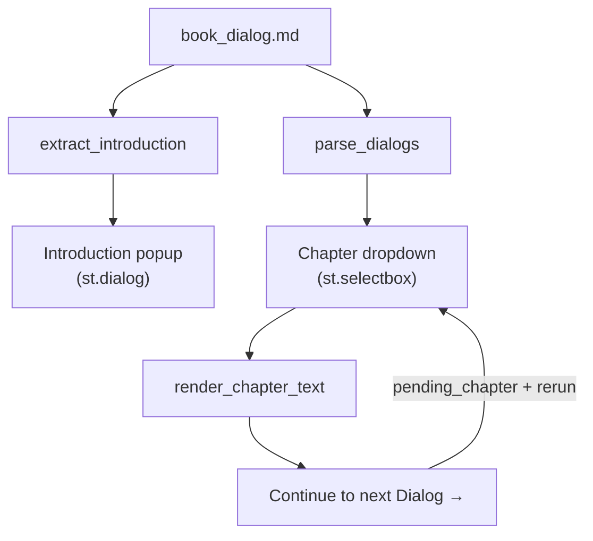

# book.py — The Entry Point of a Living Quantum Textbook

## Introduction

`book.py` is the top-level Streamlit application for `quant2`. It orchestrates
every other component: loads the stylesheet and a small JS helper, triggers
registration of all visualization modules, reads the book's content, splits
it into six chapters, and renders one at a time behind a dropdown selector.

The pedagogical structure is a Socratic dialog between Aristotle and Plato,
split across six chapters. A separate, short first-person "Introduction"
section — the story of how the book itself was made — is not one of those
chapters; it lives behind a small byline under the title and opens in a
popup dialog.



---

## Path Setup and Static Asset Loading

The file begins with a path fix for Streamlit's execution model, followed by
loading two static assets — a CSS stylesheet and a small JS helper:

```python
CSS = (Path(__file__).parent / "styles" / "main.css").read_text()
SCROLL_TOP_JS = (Path(__file__).parent / "styles" / "scroll_top.js").read_text()
```

Both assets follow the prescribed pattern: loaded via `Path(__file__).parent`,
read eagerly at import time so a rerun never pays for repeated disk I/O, and
kept as plain `.css`/`.js` files so no CSS or JavaScript string ever appears
inline in Python source — a hard style-guide rule in this project.

---

## Registering Visualizations via Side-Effecting Imports

A sequence of imports trigger visualization registration as a side effect:

```python
import viz.single_qubit_anim  # noqa: F401
import viz.qubit_grid          # noqa: F401
# ... (11 modules total)
```

Each `viz.*` module calls `registry.register(name, fn)` on import. The
`chapter_renderer` later resolves `:visualize name` directives against this
registry. This pattern keeps each visualization self-contained; `book.py`
only needs to ensure the modules are loaded.

---

## Splitting the Book: Chapters vs. the Introduction

The book is one markdown file with `---` separating `## `-headed sections.
Two functions read it two different ways. `extract_introduction` pulls out
the one section titled "Introduction" for the popup:

```python
def extract_introduction(text: str) -> str | None:
    sections = re.split(r"\n---\n", text)
    for section in sections:
        section = section.strip()
        if section.startswith("## Introduction"):
            return section
    return None
```

`parse_dialogs` returns everything *except* that section, as `(label,
content)` pairs for the dropdown:

```python
def parse_dialogs(text: str) -> list[tuple[str, str]]:
    sections = re.split(r"\n---\n", text)
    dialogs = []
    for section in sections:
        section = section.strip()
        if not section.startswith("## ") or section.startswith("## Introduction"):
            continue
        title = section.splitlines()[0][3:].strip()
        dialogs.append((title, section))
    return dialogs
```

Note what `parse_dialogs` does *not* do: it no longer builds the "Dialog N:"
label itself. Earlier versions of this function numbered chapters
programmatically (`f"Dialog {i}: {title}"`). That numbering now lives
directly in the markdown headings (`## Dialog 1: Qubits`, `## Dialog 2:
Quantum Gates`, ...) — the heading text is used verbatim as the label. This
makes the heading the single source of truth: the dropdown entry and the
bold chapter title rendered on the page can never drift out of sync, because
they're the same string read from the same place.

---

## The Introduction Popup

The Introduction is rendered on demand, in a Streamlit-native modal:

```python
@st.dialog("Introduction")
def show_introduction(content: str) -> None:
    render_chapter_text(content, [0])


def render_byline(introduction: str | None) -> None:
    label = f"Pito Salas - {BOOK_VERSION} - {BOOK_DATE}"
    with st.container(key="byline"):
        if introduction:
            if st.button(label, key="byline_button"):
                show_introduction(introduction)
        else:
            st.markdown(label)
```

`st.container(key="byline")` exists purely as a CSS hook — Streamlit stamps
a `st-key-byline` class onto the container's DOM node, which `main.css`
targets to make the button look like a small underlined byline instead of
the app's usual gold accent button.

---

## Switching Chapters: the Dropdown, and Why It Replaced Tabs

`book.py` originally rendered chapters as Streamlit tabs (`st.tabs`), with
`←`/`→` buttons that clicked the DOM tab element via injected JS. That broke
down once chapter titles grew long enough to overflow the tab strip:
Streamlit's overflow handling (scroll arrows, an edge fade gradient) is
designed to blend into the *system* light/dark theme, and this app pins its
own fixed color scheme regardless of theme — the fade gradient rendered as a
stray black-to-white bar, and CSS aimed at the arrow buttons made things
worse before finally giving up. A dropdown sidesteps the whole class of
problem, at the cost of losing the always-visible tab strip.

```python
def render_continue_button(target_label: str, key: str) -> None:
    if st.button("Continue to next Dialog →", key=key):
        st.session_state[PENDING_CHAPTER_KEY] = target_label
        st.rerun()
```

The tricky part: Streamlit forbids writing to a widget's own session-state
key anywhere in a script run *after* that widget has already been
instantiated in that run. Since `render_continue_button` is called after
`st.selectbox(..., key=CHAPTER_SELECT_KEY)` in `main()`, it can't write to
`CHAPTER_SELECT_KEY` directly — doing so raises `StreamlitAPIException`.
Instead it stashes the target label under a separate `PENDING_CHAPTER_KEY`
and reruns; `main()` promotes that pending value onto `CHAPTER_SELECT_KEY`
*before* creating the selectbox on the next run, which is the one place
it's legal to do so.

That same moment — right after promoting a pending chapter switch — is also
when the page needs to scroll back to the top, since Streamlit reruns don't
reset scroll position on their own:

```python
pending = st.session_state.pop(PENDING_CHAPTER_KEY, None)
if pending is not None:
    st.session_state[CHAPTER_SELECT_KEY] = pending
    st.iframe(f"<script>{SCROLL_TOP_JS}</script>", height=1)
```

`st.iframe` with a raw (non-URL, non-file-path) string embeds it as
`srcdoc` — an inline HTML document the browser parses and executes,
`<script>` included. `scroll_top.js` reaches out via `window.parent`
(the iframe's parent is the real app document) and scrolls the actual
Streamlit content container, not just `window` — `window.scrollTo` alone
turned out to have no visible effect, because Streamlit's scrollable
region is an inner `[data-testid="stMain"]` element, not the browser
window itself.

---

## The main() Function

```python
def main():
    st.set_page_config(page_title="The Quantum Computing Dialogs", layout="centered")
    st.markdown(f"<style>{CSS}</style>", unsafe_allow_html=True)
    st.title("The Quantum Computing Dialogs")

    text = BOOK_FILE.read_text()
    introduction = extract_introduction(text)
    render_byline(introduction)

    dialogs = parse_dialogs(text)
    chapter_labels = [label for label, _ in dialogs]
    content_by_label = dict(dialogs)

    pending = st.session_state.pop(PENDING_CHAPTER_KEY, None)
    if pending is not None:
        st.session_state[CHAPTER_SELECT_KEY] = pending
        st.iframe(f"<script>{SCROLL_TOP_JS}</script>", height=1)

    selected_label = st.selectbox(
        "Chapter", chapter_labels, key=CHAPTER_SELECT_KEY,
        label_visibility="collapsed",
    )
    i = chapter_labels.index(selected_label)

    viz_counter = [0]
    render_chapter_text(content_by_label[selected_label], viz_counter)
    if i < len(dialogs) - 1:
        render_continue_button(chapter_labels[i + 1], key=f"continue_{i}")
```

Unlike the old tab-based version, only the *selected* chapter's content is
rendered each run — with tabs, Streamlit renders every tab's body on every
run (CSS just hides the inactive ones), so switching to a dropdown also cut
the amount of work done per rerun. `viz_counter` is a single-element list —
a mutable container passed by reference so `render_chapter_text` can
increment a shared counter within the one chapter being rendered, giving
each `:visualize` directive a unique widget key.

---

## Observations on Improvement

**Auto-discovery of viz modules.** The eleven explicit `import viz.*` lines
must be kept in sync with the `viz/` directory by hand. Scanning
`Path(__file__).parent.glob("viz/*.py")` and importing programmatically would
make adding a new visualization a single-file operation.

**Chapter numbering lives in content, not code — by design, but unchecked.**
Since `## Dialog N: Title` numbering is now hand-written in
`book_dialog.md` rather than computed, nothing stops the numbers from
skipping or repeating if a chapter is reordered by hand. A cheap test
asserting the extracted numbers are `1..len(dialogs)` in order would catch
that class of content bug.

**Book file is hardcoded.** `BOOK_FILE` is a fixed path. If the project
grows to multiple books or configurable content paths, this will need to
become a parameter or config value.

**No error handling on missing content file.** If `BOOK_FILE` is absent the
app raises an unhandled `FileNotFoundError`. A `st.error()` with a clear
message would be more useful in a deployed environment.

**Scroll-to-top is a one-shot side effect tucked into state plumbing.** It
works, but reads like an aside inside the pending-chapter logic. A small
`scroll_to_top()` helper would make the "why is there an iframe here" less
surprising to a future reader.
